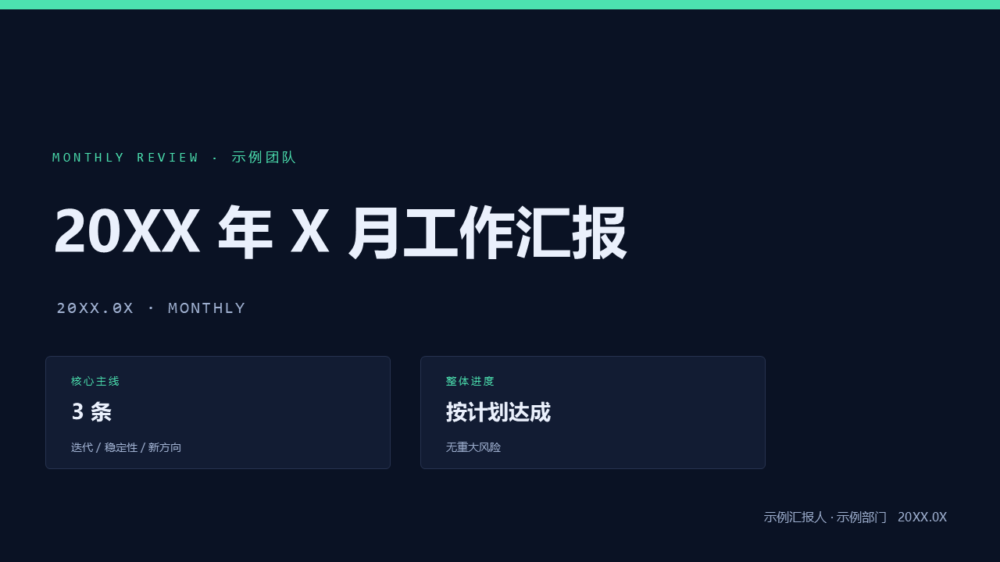
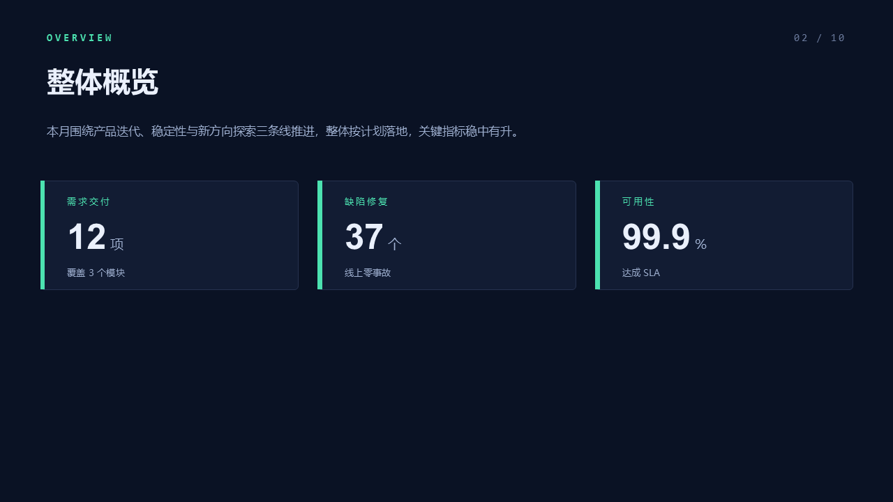
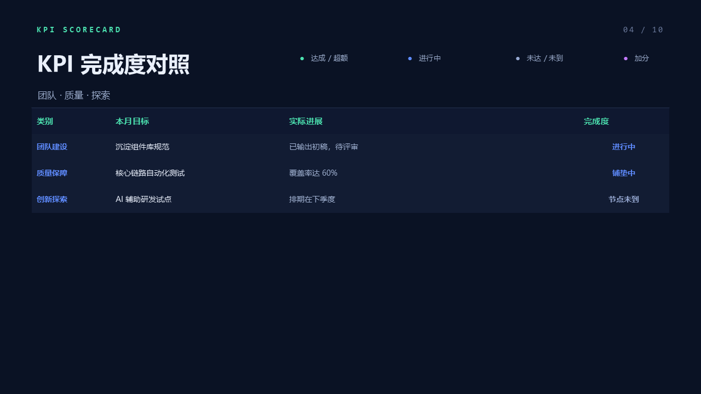
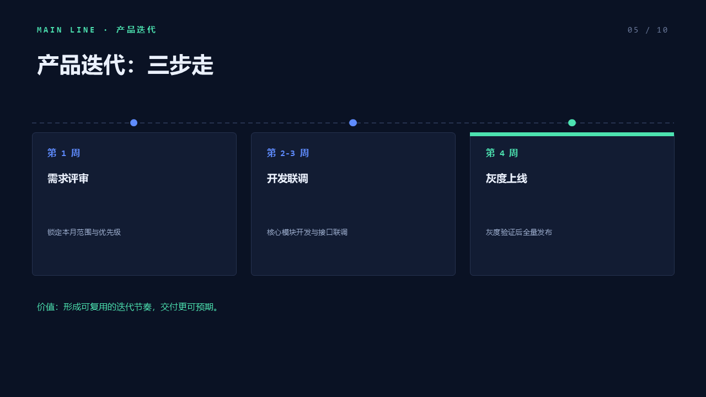

# Dark-Tech Report Generator

**English** | [简体中文](README.zh-CN.md)

Turn a structured `report.json` into a dark-tech, **editable** PowerPoint (`.pptx`) work report — monthly, quarterly, half-year, or annual. Data and styling are separated, so you change the JSON and re-run; the deck stays consistent. The output is a real `.pptx` you can keep editing in PowerPoint / Keynote / WPS.

Works on any agent harness (Claude Code / Cursor / Codex) or as a plain CLI. Pure JS, offline, deterministic.

## Screenshots
<p align="center">
  
  
  
  
</p>

> Regenerate previews from any `.pptx`: `node scripts/preview.js out.pptx` (needs LibreOffice + poppler).

## Quick start

As a CLI (after install):
```bash
npm install            # installs pptxgenjs
npx dark-tech-report examples/monthly.en.json out.pptx
# or, installed globally:  npm i -g .  &&  dark-tech-report report.json out.pptx
```

Or run the script directly:
```bash
npm install
node src/build.js examples/monthly.zh.json out.zh.pptx
```

## Features
- **i18n** — built-in `zh` / `en` label packs (`meta.locale`), override any string via `meta.labels`.
- **Language-decoupled status colors** — use `level` (`done|doing|pending|bonus`) or `color`, not hardcoded words.
- **Theme presets** — `meta.theme`: `"dark"` (default) / `"midnight"` / `"light"`, or an object to override individual colors.
- **Configurable fonts** — `meta.fonts = { zh, latin, mono }` for cross-platform CJK.
- **Input validation** — structural checks with clear errors (exit 1 on hard errors); full JSON Schema in [`report.schema.json`](./report.schema.json) for editors/agents.
- **Overflow-resistant** — KPI tables, metric cards, points and roadmap rows auto-scale font/height by item count.
- **Sectioned deck** — cover, overview metrics, KPI scorecard (with optional merged tables), main-line timelines / two-column points, highlights, issues, roadmap, summary.

## Data schema & options
See [`SKILL.md`](./SKILL.md) for the full schema and field reference, and [`examples/`](./examples/) for working `report.json` files (en + zh).

## Preview / QA
```bash
soffice --headless --convert-to pdf out.pptx
pdftoppm -png out.pdf slide      # one PNG per slide
```
Or just open the `.pptx`.

## License
[MIT](./LICENSE)
